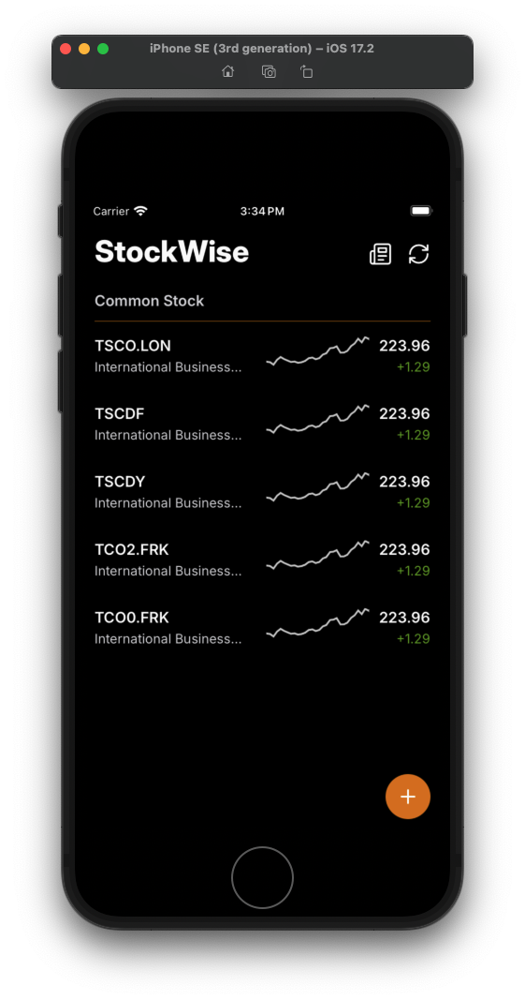
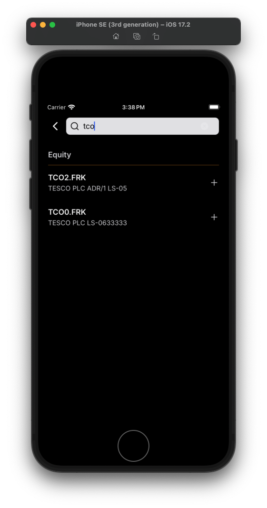
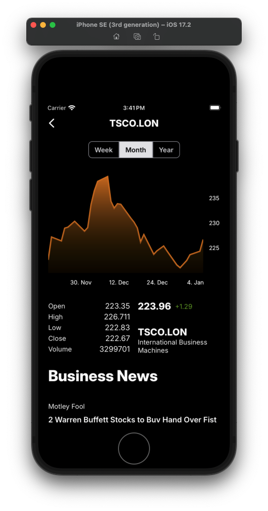

# StockWise App

StockWise is a React Native mobile app for monitoring stock investments and market data. It provides real-time watchlist, detailed asset information, and business news tracking. Key capabilities include interactive price charts, asset statistics, and a news feed for watched stocks. The app uses React Query for efficient data fetching and caching, with AsyncStorage for persistent watchlist storage.

## Key features

<div style="display: flex; align-items: flex-start; gap: 24px;">
  
  
  <div>
    <h3>Watchlist</h3>

- Real-time watchlist monitoring with automatic price updates
- Stocks grouped by asset type (e.g. Equity, ETF)
- Quick access to key metrics for each stock:
- Current price
- Price change (value and percentage)
- Mini price chart showing monthly performance
- Company name and symbol
- Pull-to-refresh functionality to manually update prices
- Swipe-to-remove stocks from watchlist
- Floating action button to easily add new stocks
- News feed accessible via bottom sheet showing latest articles for watched stocks
- Error handling and loading states for smooth user experience

  </div>
</div>

<div style="display: flex; align-items: flex-start; gap: 24px;">  
  
  
  <div>
    <h3>Adding Assets</h3>

- Search functionality with debounced input to prevent excessive API calls
- Real-time search results as you type
- Results grouped by asset type (Equity, ETF, etc.)
- Auto-focus on search input when screen opens
- Filtered results to only show assets not already in watchlist
- Loading states and error handling for search results
- Persistent storage of watchlist using AsyncStorage
- Optimized queries with React Query for caching and state management
- Back button to return to watchlist
- Automatic navigation back after adding asset
- Add to watchlist with a single tap
- Proper keyboard handling and input validation

    </div>
  </div>

<div style="display: flex; align-items: flex-start; gap: 24px;">  
   

  <div>
    <h3>Asset Details</h3>

- Interactive price chart with multiple time intervals (week/month/year)
- Real-time price and change indicators
- Detailed asset statistics:
  - Open price
  - High price
  - Low price
  - Close price
  - Volume
- Asset metadata including:
  - Current price with change indicator
  - Symbol and company name
- Interactive chart features:
  - Touch tracking with value indicators
  - Gradient area fill under line
  - Date formatting based on selected interval
- Business news feed specific to the asset
- Loading states during data fetching
- Cached queries for optimal performance

    </div>
  </div>

## Architecture

The app uses a layered architecture that separates concerns and ensures both compile-time and runtime type safety:

### Domain Layer

The domain layer defines the core business models using Zod validation schemas:

1. **Asset Model** (`models/Asset.ts`)

   - Represents financial asset data like stocks and ETFs
   - Includes price, change, volume and other market data
   - Validates all required fields at runtime
   - Used throughout the UI for displaying asset details

2. **Article Model** (`models/Article.ts`)

   - Defines structure for news articles and company updates
   - Contains source, title, summary and publishing metadata
   - Ensures consistent article data across the app

3. **Search Result Model** (`models/SearchResult.ts`)

   - Represents asset search results
   - Contains basic asset metadata for search listings
   - Validated subset of full asset data

4. **Time Series Model** (`models/TimeSeries.ts`)
   - Defines price history data points
   - Used for charting and historical analysis
   - Validates timestamp and OHLCV data

### API Layer

The API integration is split into three main parts:

1. **Type Definitions** (`types.ts`)

   - Defines TypeScript interfaces for all API responses
   - Maps external API types to domain models
   - Defines configuration types for API parameters

2. **API Client** (`client.ts`)

   - Handles direct communication with Alpha Vantage API endpoints
   - Implements data fetching and response parsing
   - Validates responses against domain schemas
   - Provides strongly typed methods for each API route:
     - `/query?function=SYMBOL_SEARCH` - Asset search
     - `/query?function=GLOBAL_QUOTE` - Real-time quotes
     - `/query?function=OVERVIEW` - Company details
     - `/query?function=TIME_SERIES_DAILY` - Daily price data
     - `/query?function=TIME_SERIES_MONTHLY` - Monthly price data
     - `/query?function=NEWS_SENTIMENT` - Company news and sentiment

3. **React Query Layer** (`queries.ts`)
   - Implements React Query hooks that wrap the API client
   - Handles caching, refetching, and server state management
   - Provides hooks like:
     - `useSearchAssetsQuery`
     - `useGetAssetDetailsQuery`
     - `useGetAssetNewsQuery`
     - `useGetStats`

This architecture provides several benefits:

- Full type safety from API response to UI through domain models
- Runtime validation ensures data integrity
- Domain models are independent of data sources
- Easy to swap API providers by updating only the API layer
- Efficient caching and background updates
- Clear separation of concerns
- Easy mocking for development/testing

### UI Layer

The UI layer follows a component-based architecture with clear separation between reusable and feature-specific components. It uses a centralized theming system for consistent styling across the app.

1. **Theme System** (`theme.ts` & `useTheme.ts`)

   - Centralized theme configuration with light/dark mode support
   - Defines design tokens for:
     - Colors and text styles
     - Spacing and layout
     - Typography and fonts
     - Border radiuses
   - Accessed via `useTheme` hook throughout the app
   - Minimal implementation focused on core concepts

2. **Reusable Components** (`components/ui/`)

   - Generic, highly reusable UI primitives
   - Follow atomic design principles
   - Components include:
     - `Flex` - Flexible layout component
     - `IconButton` - Standardized icon buttons
     - `ToggleGroup` - Segmented controls
     - `typography` - Text components (Title, Heading, Body etc)
   - Consistently themed using `useTheme`
   - Props follow common patterns

3. **Feature Components** (`components/`)

   - Specific to app features and business logic
   - Composed from reusable components
   - Follow consistent naming patterns:
     - Lists: `[Feature]List` & `[Feature]ListItem`
     - Charts: `[Feature]Chart`
     - Buttons: `[Feature]Button`
   - Examples include:
     - Watchlist components
     - Search components
     - Asset details components
     - News components

4. **Navigation Theming** (`useRootStackScreenOptions.ts`)

   - Consistent header styling across screens
   - Integrates with React Navigation
   - Uses same theme system as components

5. **Screen Components** (`screens/`)

   - **RootStack** (`RootStack.tsx`)

     - Defines app navigation structure using React Navigation
     - Configures screen transitions and headers
     - Manages navigation types and params
     - Sets up initial route and screen options

   - **Home Screen** (`Home.tsx`)

     - Main watchlist view with real-time asset monitoring
     - Implements pull-to-refresh and swipe-to-remove
     - Bottom sheet for news feed
     - FAB for adding new assets
     - Uses watchlist store for state management

   - **Asset Details Screen** (`AssetDetails.tsx`)

     - Displays detailed asset information and charts
     - Interactive price chart with interval selection
     - Real-time price updates and statistics
     - Business news feed specific to asset
     - Uses multiple queries for data fetching

   - **Add to Watchlist Screen** (`AddToWatchlist.tsx`)
     - Search interface for finding new assets
     - Real-time search results with debouncing
     - Filters out already watched assets
     - Direct add-to-watchlist functionality
     - Auto-focus search and back navigation

Key Benefits:

- Consistent styling through centralized theming
- Clear component organization and naming
- High reusability of UI primitives
- Easy dark mode support
- Type-safe props and theme values
- Simplified maintenance and updates
- Clear patterns for new components
- Modular screen architecture
- Efficient state management
- Smooth navigation flow

### Environment Variables

The app uses environment variables for API configuration and mocking. These are managed through:

- `.env` file (create from `.env.example`) with the following variables:

  - `API_URL`: Alpha Vantage API base URL
  - `API_KEY`: Your Alpha Vantage API key
  - `MOCK`: Enable/disable mock data ('true'/'false')

- Type definitions in `env.d.ts` ensure type safety when using env vars
- `babel-plugin-react-native-dotenv` configured in `babel.config.js` enables importing from `@env`
- API client (`client.ts`) uses env vars for requests
- Query hooks (`queries.ts`) conditionally use mock or real API based on `MOCK` setting

**Important:** The free tier of Alpha Vantage API has a limit of 25 requests per day. It's recommended to:

1. Set `MOCK=true` in `.env` for development to use mock client
2. Only set `MOCK=false` when testing with real API data
3. Get an API key from [Alpha Vantage](https://www.alphavantage.co) if using real data

## Running the App

To run the app locally, follow these steps:

### Prerequisites

- Node.js 18.18 or newer
- Watchman (for macOS)
- For iOS:
  - Xcode 10 or newer
  - CocoaPods
  - Command Line Tools
  - iOS Simulator
- For Android:
  - Android Studio
  - JDK 17
  - Android SDK
  - Android Virtual Device

### iOS Setup & Run

1. Install dependencies (this will also install iOS pods and link assets):

   ```bash
   npm install
   ```

2. Run on iOS simulator:
   ```bash
   npm run ios
   ```

### Android Setup & Run

1. Install dependencies:

   ```bash
   npm install
   ```

2. Run on Android emulator:
   ```bash
   npm run android
   ```

### Available Scripts

- `npm start` - Start Metro bundler with cache reset
- `npm run ios` - Run on iOS simulator with cache reset
- `npm run android` - Run on Android emulator with cache reset
- `npm run lint` - Run ESLint
- `npm test` - Run Jest tests
- `npm run pod-install` - Install iOS pods
- `npm run link-assets` - Link assets
